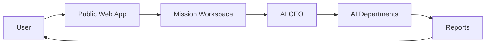
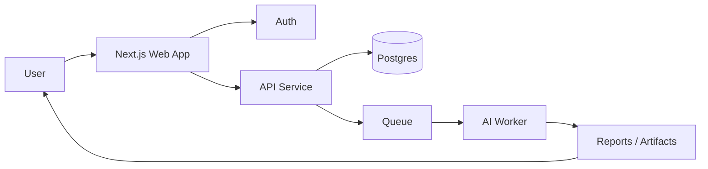
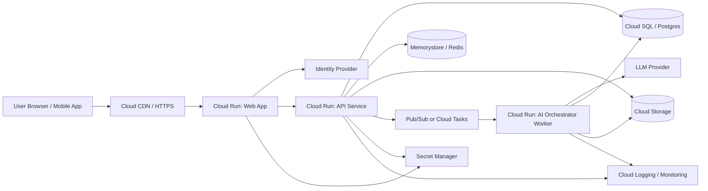

# Technical Architecture

## 1. Purpose

This document defines the technical architecture for the One-Person Company Platform. The system is planned as a public multi-user SaaS, with a landing page in this repository today and an authenticated AI-run company experience as the product evolves.

The deployment target is Google Cloud Run, with a local Docker image build flow before pushing images to Artifact Registry and deploying to Cloud Run.

## 2. Architecture Goals

- Support a public SaaS with many registered users.
- Isolate each user's private company workspace and mission data.
- Run the platform as a container on Google Cloud Run.
- Keep local development and local image builds simple.
- Support SEO-friendly public landing pages.
- Support an AI CEO that coordinates multiple department agents.
- Preserve transparent workflows, reports, and auditability.
- Keep the system secure, observable, and easy to operate.

## 3. System Overview

The platform is organized into four layers:

1. Public web experience
2. Authenticated application and API layer
3. AI orchestration and worker layer
4. Data, observability, and security services

### At-A-Glance Picture

How to read it:
- The user starts on the public web app.
- The user creates or opens a mission workspace.
- The AI CEO plans and coordinates the work.
- AI departments do the actual execution.
- Reports go back to the AI CEO and then to the user.

### Current State In This Repo
- Public landing page built with Next.js App Router.
- Static SEO pages, sitemap, robots, and metadata.
- Landing page content that explains the one-person company concept.

### Future Product State
- User sign-up and login with Google or email.
- Private company missions and workspaces.
- AI CEO orchestration.
- Department-level AI tasks and reports.
- Mobile app access to mission status and reports.

## 4. High-Level Architecture

### At-A-Glance Picture

How to read it:
- The user opens the web app.
- The web app sends requests to auth and API services.
- The API stores state in the database and queues AI work.
- The worker generates reports and artifacts.
- Reports return to the user.

## 5. Deployment Model On Google Cloud Run

### Web Service
The public website and future authenticated frontend run as a containerized service on Cloud Run.

Recommended approach:
- Build the web application locally.
- Package the build output into a Docker image.
- Push the image to Artifact Registry.
- Deploy the image to Cloud Run.

For the current repository, the web experience is a Next.js app with static export-friendly routes, sitemap, and robots files. The container should serve the built output reliably over HTTPS.

### API Service
The core application API should run as a separate Cloud Run service once the product moves beyond landing-page-only scope.

Responsibilities:
- Authentication callbacks
- Mission creation and retrieval
- Workspace and permission enforcement
- Report storage and retrieval
- Mission state updates

### Worker Service
AI orchestration should run asynchronously in a worker Cloud Run service or job-style processor.

Responsibilities:
- Launch department tasks
- Call LLMs
- Aggregate reports
- Reconcile conflicts
- Produce AI CEO summaries

## 6. Local Build And Container Strategy

### Build Flow
1. Develop locally.
2. Run the application build.
3. Build a Docker image locally.
4. Run the image locally.
5. Push the image to Artifact Registry.
6. Deploy to Cloud Run.

### Recommended Container Pattern
- Use a multi-stage Dockerfile.
- Build the application in a Node.js builder stage.
- Serve the production output in a lean runtime stage.
- Inject runtime config through environment variables and Secret Manager.

### Local Developer Commands
- `npm install`
- `npm run dev`
- `npm run build`

### Local Container Commands
- `docker build -t auto-page:local .`
- `docker run --rm -p 8080:8080 auto-page:local`

## 7. Frontend Architecture

### Technology Choice
- Next.js App Router
- React
- TypeScript
- Tailwind CSS

### Responsibilities
- Serve SEO-friendly public pages.
- Render marketing content and landing-page sections.
- Provide authenticated UI shells later.
- Reuse shared design tokens and copy blocks.

### SEO Requirements
- Metadata for title, description, canonical URL, Open Graph, Twitter.
- `robots.txt` and `sitemap.xml` routes.
- Structured data in JSON-LD.
- Crawlable internal links and semantic headings.

## 8. Application Architecture For The SaaS Product

### 8.1 Authentication And Identity
Supported login methods:
- Google OAuth
- Email-based authentication

Identity handling:
- Use a managed identity layer or external auth provider.
- Store application user records separately from identity provider state.
- Support email verification and password reset for email users.

### 8.2 Multi-Tenant Workspace Model
Every user can own one or more company workspaces.

Core entities:
- User
- CompanyWorkspace
- Mission
- MissionRun
- DepartmentTask
- Artifact
- Report
- AuditLog

Isolation rules:
- Every read and write must be scoped to the authenticated user or authorized workspace.
- Private mission data must never be accessible across tenants.
- Public idea-library content stays separate from private mission data.

### 8.3 AI CEO Orchestration
The AI CEO is the mission orchestrator.

Responsibilities:
- Interpret the user's goal.
- Create the plan.
- Decide which departments are needed.
- Request clarification only when needed.
- Resolve tradeoffs between departments.
- Deliver the final report.

### 8.4 Department Agents
Department agents are specialized workers that handle a narrow function.

Suggested departments:
- Research
- Product
- Design
- Engineering
- Marketing
- Sales
- Operations
- Finance
- QA
- Legal / Compliance

### 8.5 Asynchronous Execution
Agent work should not block the request/response cycle.

Recommended pattern:
- User creates a mission.
- API writes mission state to the database.
- API enqueues orchestration tasks.
- Worker processes tasks asynchronously.
- Worker writes department artifacts and report outputs.
- UI polls or subscribes for status updates.

## 9. Data Architecture

### Primary Data Store
Use PostgreSQL for the core application data.

Why:
- Strong relational model for missions, tasks, and reports.
- Easy to enforce workspace-scoped access.
- Good fit for audit logging and state transitions.

### Object Storage
Use Cloud Storage for artifacts and generated files.

Examples:
- Exported reports
- Uploaded reference documents
- Generated images or attachments

### Cache And Rate Limiting
Use Redis or Memorystore for:
- Short-lived session or token state
- Rate limiting
- Queue coordination if needed

### Search
Optional later component for:
- Mission history
- Idea library search
- Full-text report lookup

## 10. Google Cloud Services Recommendation

### Required For First Production Version
- Cloud Run
- Artifact Registry
- Cloud SQL (Postgres)
- Cloud Storage
- Secret Manager
- Cloud Logging
- Cloud Monitoring
- Cloud Build or local build plus push flow

### Optional As Scale Increases
- Pub/Sub
- Cloud Tasks
- Memorystore
- Cloud Scheduler
- BigQuery for product analytics

## 11. Security Architecture

### Authentication Security
- Use OAuth for Google sign-in.
- Hash and salt passwords if email auth is implemented.
- Enforce secure sessions and token rotation.
- Require email verification for email-based accounts.

### Authorization Security
- Enforce workspace-level access checks on every private route and API call.
- Never trust client-side ownership claims.
- Use server-side policy checks before reading or writing private resources.

### Secret Management
- Store secrets in Secret Manager.
- Do not commit secrets to git.
- Load credentials through environment variables in Cloud Run.

### Auditability
- Log authentication events.
- Log mission creation, mission updates, report generation, and export events.
- Keep a trace of AI CEO decisions and department output revisions.

### Data Protection
- Encrypt traffic in transit with HTTPS.
- Encrypt persistent data at rest.
- Minimize data collection and retention.

## 12. Observability

### Logging
- Application logs to Cloud Logging.
- Structured JSON logs for mission lifecycle events.
- AI orchestration logs with mission and workspace identifiers.

### Monitoring
- Request latency
- Error rate
- Queue backlog
- Mission completion rate
- Agent execution time

### Alerting
- Failed authentication spikes
- Error spikes in API or worker
- Orchestration backlog growth
- Missing final report generation

## 13. API And Worker Contract

### API Responsibilities
- Accept mission creation requests.
- Validate user identity and workspace access.
- Persist mission state.
- Create tasks for orchestration.
- Return current mission status.

### Worker Responsibilities
- Read mission context.
- Call the AI model.
- Write artifacts and reports.
- Update mission state transitions.
- Mark missions complete when all required outputs exist.

### Contract Rules
- Requests must include mission and workspace IDs.
- Workers must never process data outside their workspace scope.
- All outputs must be attributable to a mission run.

## 14. AI Provider Integration

### LLM Use Cases
- Mission planning
- Clarification generation
- Department task execution
- Final CEO summary
- Report refinement

### Provider Safety
- Add prompt templates for each department.
- Keep structured prompts and structured outputs.
- Track response quality and failure modes.
- Support provider fallback where needed.

## 15. Environment Strategy

### Local
- `.env` for local secrets.
- `npm run dev` for app development.
- Local Docker build for Cloud Run parity.

### Staging
- Separate Cloud Run service and database.
- Separate secrets and test data.
- Mirror production deployment process.

### Production
- Artifact Registry images.
- Cloud Run services.
- Managed database and secrets.
- Production logging and alerting.

## 16. Suggested Repository Evolution

If the product expands beyond landing-page-only content, the repo should separate concerns into:
- Public frontend
- API routes or separate API service
- Worker orchestration code
- Shared prompt and skill definitions
- Infrastructure configuration

## 17. Implementation Phases

### Phase 1: Marketing Site And SEO
- Public landing page
- SEO metadata
- Sitemap and robots
- Static deployment

### Phase 2: Authenticated SaaS Shell
- Google and email sign-in
- Workspace model
- Mission creation and status pages
- Basic authorization

### Phase 3: AI CEO And Departments
- Mission orchestration
- Department agent execution
- Report generation
- Audit logs for decisions and outputs

### Phase 4: Scale And Reliability
- Queue-based orchestration
- Monitoring and alerts
- Better search and exports
- Mobile app support

## 18. Risks And Constraints

- Multi-agent workflows can become slow if orchestration is synchronous.
- Public SaaS requires strong tenant isolation from day one.
- Cloud Run services should remain stateless.
- Long-running AI jobs must move to worker or queue patterns.
- Static export and dynamic SaaS concerns should be separated cleanly.

## 19. Recommended Next Engineering Steps

1. Keep the current landing page as the public SEO surface.
2. Add a separate API and worker service when private missions are built.
3. Use Cloud Run for all containerized runtime services.
4. Store secrets in Secret Manager and keep `.env` local only.
5. Add workspace-scoped database models before building agent orchestration.
6. Introduce a queue for AI CEO and department jobs before scaling usage.

## 20. Local Build To Cloud Run Flow

1. Develop locally.
2. Build the container image on the workstation.
3. Test the image locally.
4. Push the image to Artifact Registry.
5. Deploy the image to Cloud Run.
6. Verify logs, environment variables, and health checks.

## 21. Summary

The right architecture for this product is a Cloud Run-based, containerized SaaS with:
- a public SEO-first web surface,
- a strict multi-tenant data model,
- async AI orchestration,
- managed secrets,
- and strong observability.

This keeps the current repo simple today while making it ready for the authenticated, AI-run company platform described in the PRD.
